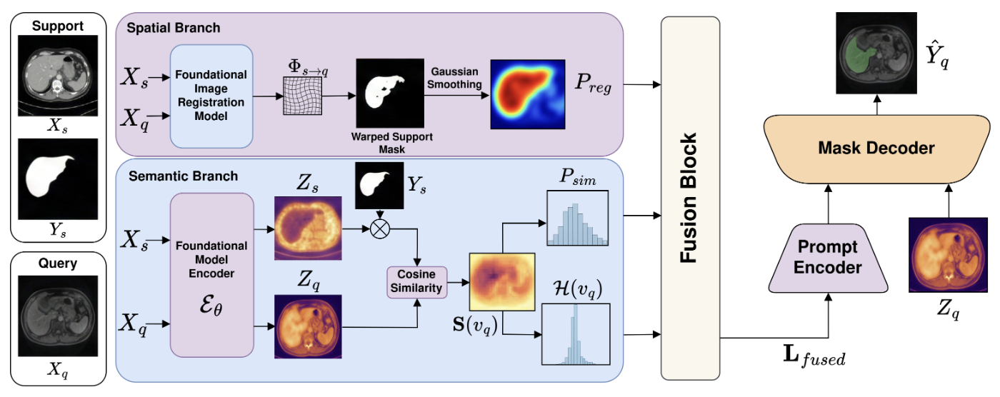

<div align="center">
  
# Uncertainty-Aware Spatio-Semantic Contextual Prompts for Multimodal Medical Segmentation

### **MICCAI 2026 _(early accept)_**

[Soumitri Chattopadhyay](https://soumitri2001.github.io) · Basar Demir · Marc Niethammer

[UCSD Biomedical Image Analysis Group](https://cseweb.ucsd.edu/~mniethammer/)

</div>

## Abstract

The vast heterogeneity of medical imaging demands developing universal and modality-transferable segmentation models that can ideally work in low-data regimes. Although few-shot cross-domain, in-context learning, and promptable foundational models have emerged as promising data-efficient domain-agnostic solutions, they are all limited either in dimensionality (2D only), scalability (interactive prompting being too slow and iterative), or require re-training for each new task, limiting their general applicability. In this work, we address these limitations and propose a novel framework that harnesses the representational capabilities of foundational models to generate spatial and semantic contextual priors that holistically describe the target structure to be segmented. We also propose a confidence-weighted dynamic gating scheme to fuse these context maps into a single dense prompt, and re-purpose a frozen foundational segmentation model, SAM-Med3D, to predict segmentations using this fused representation instead of sparse points. Our framework is modality-agnostic, training-free, scalable, and enables rapid and robust universal segmentation. We validate our approach on two abdominal CT and MRI datasets under cross-modal and intra-modal settings, and show it outperforms existing state-of-the-art methods by significant margins. 

---

<div align="center">
  
</div>

---

### Setup

```bash
conda create -n medsam python=3.10 -y
conda activate medsam
pip install -r requirements.txt
```

---

### Data layout

Place datasets under `./data_autoprompt/` (gitignored). Expected layout matches our experiments: per-organ folders with `imagesTr` / `labelsTr`, paired by filename. Follow [SAM-Med3D](https://github.com/uni-medical/SAM-Med3D) for data layout instructions.

---

### SAM-Med3D checkpoint

1. Download **`sam_med3d_turbo.pth`** from the [SAM-Med3D Hugging Face repo](https://huggingface.co/blueyo0/SAM-Med3D/tree/main).
2. Save it as **`checkpoints/sam_med3d_turbo.pth`** (or set **`SAM_MED3D_CHECKPOINT`** to an absolute path).

---

### Running

From the repository root (the directory that contains `main.py`):

```bash
python main.py \
  -qp ./data_autoprompt/BTCV \
  -sp ./data_autoprompt/BTCV \
  -qmod ct -smod ct \
  --save_path ./results_final/intradataset/BTCV/1shot
```

Defaults are aligned with our paper runs (e.g. 1-shot, `pairs_per_query=5`, no ICON finetune steps, dense prompts only). Override as needed; see `python main.py --help`.

---


**Acknowledgments:** The authors express gratitude to all contributors and maintainers of [SAM-Med3D](https://github.com/uni-medical/SAM-Med3D), [MultiGradICON](https://github.com/uncbiag/uniGradICON) and [UniGradICON](https://github.com/uncbiag/uniGradICON) for their open-source codes and models. Please cite their respective papers if you are using our codebase!

## Citation
```
@inproceedings{chattopadhyay2026uncertainty,
  title = {Uncertainty-Aware Spatio-Semantic Contextual Prompts for Multimodal Medical Segmentation},
  authors = {Chattopadhyay, Soumitri and Demir, Basar and Niethammer, Marc},
  booktitle = {MICCAI},
  year = {2026}
}
```

---

